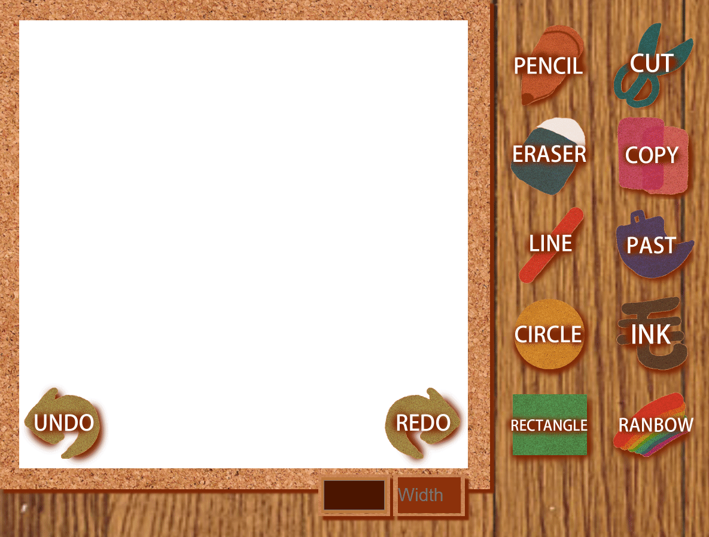

# Software Studio 2018 Spring Assignment 01 Web Canvas

## Web Canvas
</img>

## Todo
1. **Fork the repo ,remove fork relationship and change project visibility to public.**
2. Create your own web page with HTML5 canvas element where we can draw somethings.
3. Beautify appearance (CSS).
4. Design user interaction widgets and control tools for custom setting or editing (JavaScript).
5. **Commit to "your" project repository and deploy to Gitlab page.**
6. **Describing the functions of your canvas in REABME.md**

## Scoring (Check detailed requirments via iLMS)

|                       **Item**                   | **Score** |
|:--------------------------------------------:|:-----:|
|               Basic components               |  60%  |
|                 Advance tools                |  35%  |
|            Appearance (subjective)           |   5%  |
| Other useful widgets (**describe on README.md**) | 1~10% |

## Reminder
* Do not make any change to our root project repository.
* Deploy your web page to Gitlab page, and ensure it works correctly.
    * **Your main page should be named as ```index.html```**
    * **URL should be : https://[studentID].gitlab.io/AS_01_WebCanvas**
* You should also upload all source code to iLMS.
    * .html or .htm, .css, .js, etc.
    * source files
* **Deadline: 2018/04/05 23:59 (commit time)**
    * Delay will get 0 point (no reason)
    * Copy will get 0 point
    * "屍體" and 404 is not allowed

Report:
功能:

Circle:可以用畫筆畫出圓形的樣式。
Square:可以用畫筆畫出方形的樣式。
以上兩種主要是畫筆的不同，如果筆刷小，看不太出差別，但如果筆刷大就可以很明顯看出一格一格的不同，
但Square會有"太方"的問題，導致直線看起來會像一條一條的線，品質不好。

畫筆的部分是從網路上找到的。
首先要判斷滑鼠的位置與按鍵，這個是很重要的部分，因為canvas幾乎所有的功能都要仰賴滑鼠的滑動與點擊，所以判斷滑鼠的位置與點擊是重要的一環。方法大致上是用X與Y座標來判斷位置，再用click判斷有沒有點擊。之後要把前一個的位置跟後一個的位置連起來，所以看起來就會像畫筆畫過去一樣。但小缺陷是畫太多之後會有類似lag的狀況發生，導致畫筆軌跡會愈來愈線條，最後會趨近直線。

Color:可以控制畫筆的顏色。
Size:可以控制畫筆的大小。

Eraser可以把畫過的東西擦掉。
橡皮擦的功能其實很簡單，就只是把畫筆的顏色調成白色之後蓋過去(因為底色是白色)，這方面沒有太大的困難。

Refresh可以把整個canvas清空，回歸到最原始的狀態。
因為javascript裡面為了計算畫筆等等的步驟，所以有用到一些counter的功能，所以refresh的一個重點是要把counter清空。

Text可以在滑鼠指定點擊的地方打字，方法是按text之後用滑鼠按canvas的隨便一個地方，然後打字。
一開始設計的時候text只能在同一個地方重覆輸入，超弱。後來想到用類似像畫筆的概念，利用判斷滑鼠位置來決定要在哪邊打字。
本來應該要可以控制text內容的字體跟大小，如果可以的話還希望可以控制顏色，但後來一直用不好就放棄了。

Font:可以控制字體(好像沒用)。

Undo:可以把整個canvas還原到最新一次點擊前的狀態。
Redo:如果有undo過，可以還原到最新一次undo前的狀態。
這個部分著實頭痛了一段時間，後來用陣列跟counter把每一次點擊存起來，這樣就可以用undo或redo去控制canvas。


