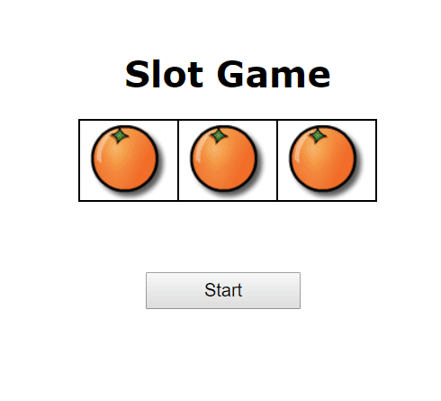

# Software Studio 2018 Spring Lab05 SlotGame

## Grading Policy
* **Deadline: 2018/04/03 17:20 (commit time)**

## Goal
1. Fork this repo to your account, remove fork relationship and change project visibility to public
2. Complete the slot game.
    * Trace code (all .html, .css, .js, etc.)
        * Basic jQuery usage
        * Window.setInterval, clearInterval()
        * Try to understand how to use jQuery simple plug-in **"Spritely"**
    * **Finish 5 TODOs in slot.js**
3. Commit changes, and deploy to GitLab page.

